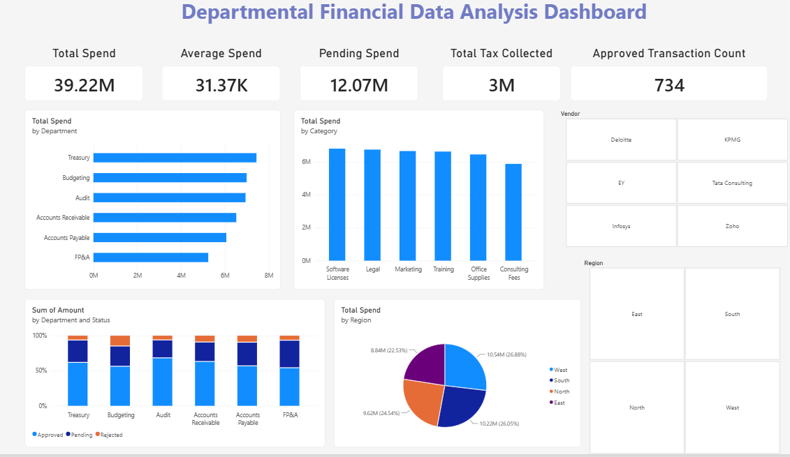
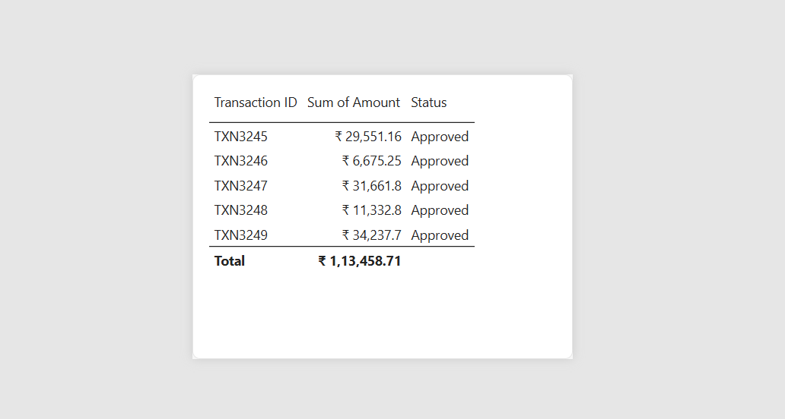

# Departmental Financial Data Analysis — Power BI Dashboard

An interactive Power BI dashboard analyzing departmental spend, tax, and approval status across 1,250 financial transactions — built to help finance/ops stakeholders quickly spot spend concentration, approval bottlenecks, and vendor/region trends.



## 📊 Project Overview

The dataset contains 1,250 transaction records spanning 6 departments, 6 spend categories, 6 vendors, and 4 regions. Raw data had inconsistent nulls (missing tax rates, invoice numbers, and notes) that required cleaning before analysis.

**Goal:** Turn raw transactional data into a decision-ready dashboard showing where money is going, how much is pending approval, and how tax liability breaks down — with drill-down detail available on hover.

## 🛠️ Tools Used

- **Power Query (M)** — data cleaning: null handling, type correction, derived column creation
- **Power BI Desktop** — data modeling, DAX measures, dashboard design
- **DAX** — KPI calculations (Total Spend, Average Spend, Total Tax Collected, Approved Transaction Count, Pending Spend)
- **Excel** — source data format

## 🧹 Data Cleaning (Power Query)

- Replaced missing **Tax Rate (%)** values (291 rows) with 0, treating unspecified rates as untaxed
- Replaced missing **Invoice Number** values (597 rows) with `"Not Assigned"`
- Replaced missing/placeholder **Notes** values (`-` and blanks, ~500+ rows) with `"No Notes"`, using exact cell-match replacement to avoid corrupting text like "Follow-up required"
- Corrected column data types (notably fixing a Whole Number vs Decimal Number mismatch on the derived Tax Amount column, which was causing aggregation errors)
- Added a derived **Tax Amount** column: `Amount × Tax Rate % / 100`

## 📐 Key DAX Measures

```DAX
Total Spend = SUM('Financial Transactions'[Amount])

Average Spend = AVERAGE('Financial Transactions'[Amount])

Total Tax Collected = SUM('Financial Transactions'[Tax Amount])

Approved Transaction Count =
CALCULATE(
    COUNTROWS('Financial Transactions'),
    'Financial Transactions'[Status] = "Approved"
)

Pending Spend =
CALCULATE(
    SUM('Financial Transactions'[Amount]),
    'Financial Transactions'[Status] = "Pending"
)
```

## 📈 Dashboard Features

- **5 KPI cards**: Total Spend, Average Spend, Total Tax Collected, Approved Transaction Count, Pending Spend
- **Department-wise spend** (bar chart)
- **Category-wise spend** (column chart)
- **Regional spend distribution** (pie chart)
- **Spend by status per department** (100% stacked column — Approved / Pending / Rejected)
- **Region and Vendor slicers** for interactive filtering
- **Custom hover tooltip** on the department chart, showing the top 5 transactions (by amount) for the hovered department



## 🔍 Key Insights

- Total spend across all departments: **₹3.92 crore** (₹39.2M) across 1,250 transactions, averaging **₹31,373** per transaction
- **Treasury** is the highest-spending department (₹74.4L), followed closely by **Budgeting** (₹70.0L) and **Audit** (₹69.4L) — spend is fairly evenly distributed across departments (no single department dominates)
- **₹1.21 crore (₹12.07M)** in spend is still **Pending** approval — roughly 31% of Approved spend, indicating a meaningful backlog worth monitoring
- Of 1,250 transactions, **734 are Approved**, 390 Pending, and 126 Rejected — a 58.7% approval rate
- **West region** leads spend (₹1.05 crore, 26.9%), with the four regions otherwise fairly balanced (22.5%–26.9% each)
- **Software Licenses** is the top spend category (₹68.1L), with all six categories clustered fairly closely (₹58.9L–₹68.1L)

## 📁 Repository Structure

```
departmental-financial-analysis-powerbi/
├── README.md
├── Finance_BI.pbix
├── data/
│   └── Departmental_Financial_Data_Analysis.xlsx
└── screenshots/
    ├── overview.png
    └── tooltip-demo.png
```

## 🚀 How to Explore

1. Clone/download this repository
2. Open `Finance_BI.pbix` in [Power BI Desktop](https://powerbi.microsoft.com/desktop/) (free)
3. Use the Region and Vendor slicers to filter the dashboard
4. Hover over any bar in the "Total Spend by Department" chart to see top transaction detail for that department

---
*Built as a portfolio project to demonstrate Power Query data cleaning, DAX measure design, and interactive Power BI dashboard development.*
